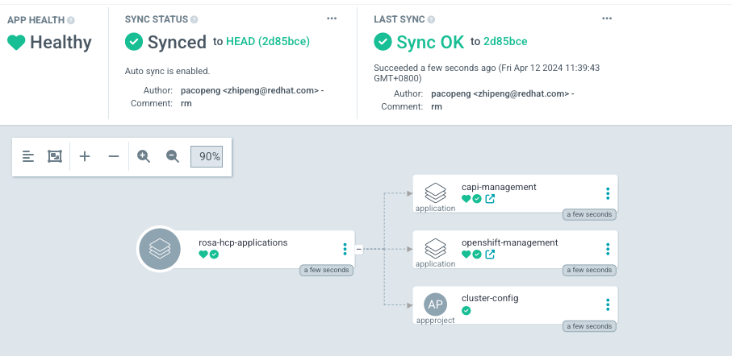

# Declarative OpenShift

### Looking for old stuff?
Are you looking for older content that used to exist here? If so, please check out the [v1.0.0 release](https://github.com/redhat-cop/declarative-openshift/releases/tag/v1.0.0).

## Overview
This repository contains sets of example resources to be used with a [declarative management strategy](https://kubernetes.io/docs/tasks/manage-kubernetes-objects/declarative-config/). Please familiarize yourself with the terminology in that document before reading on.

## Kubernetes Cluster API
Starting with the 2.x version of this repositry, the focus is on using [Cluster API](https://cluster-api.sigs.k8s.io/) paired with a varity of tools to support the full declarative approach for OpenShift Cluster provisioning / bootstrapping, upgrades and multi-cluster & multi-account management.

### CAPA - Cluster API Provider AWS
For managing clusters hosted on AWS, including [Red Hat OpenShift on AWS (ROSA)](https://www.redhat.com/en/technologies/cloud-computing/openshift/aws), we utilize [CAPA](https://cluster-api-aws.sigs.k8s.io/) as it nicely integrates and works together with CAPI.

## OpenShift GitOps - ArgoCD
[Red Hat OpenShift GitOps](https://www.redhat.com/en/technologies/cloud-computing/openshift/gitops) may now play a role in the entire lifecycle of a cluster, and the entire deployment. Not only can be it be used to manage the content of an operational OpenShift cluster, but it can also be used as part of a management cluster setup to manage the targeted clusters mananged with CAPI.

### ClusterResourceSet
As part of bootstrapping a new environment, there is a need to inject new content to allow for connectivity and initial setups for connecting tooling to talk to the cluster. This can be achieved in multiple ways - including running OpenShift GitOps **in the cluster** for a full content management, or using [ClusterResourceSet](https://cluster-api.sigs.k8s.io/developer/architecture/controllers/cluster-resource-set.html) to manage a minimal set of content in the even that an external content management system is used (e.g.: running OpenShift GitOps at a centralized management cluster).

## Managing OpenShift Clusters

### Prerequisites
Before applying any of the manifests to create a new cluster(s), the following prerequisites need to be met:
 - A valid AWS account with full admin access
 - A valid account for [Red Hat Hybrid Cloud Console](https://console.redhat.com/openshift/overview)
 - [Steps 1-3 here](https://docs.aws.amazon.com/rosa/latest/userguide/getting-started-hcp.html#getting-started-hcp-step-1) to create the necessary VPC configuration and account and operator roles. 

**_NOTE_**: _Steps 1-3 from above prerequisites,like network,account roles and operator roles  can be provision by integrated tools like [ACK](https://aws.amazon.com/blogs/containers/aws-controllers-for-kubernetes-ack/), [Terraform](https://www.terraform.io/), [Ansible](https://www.ansible.com/) and  [crossplane](https://docs.crossplane.io/) etc. please refer to [here](./integrations/README.md) for more details. 


### Management Cluster 
In order to deploy a new OpenShift Cluster using CAPI, you will need a management cluster with the necessary CAPI and CAPA deployments in an operational state. 

To get started, install the following tools on your local machine:
 - [AWS CLI](https://docs.aws.amazon.com/cli/latest/userguide/cli-chap-getting-started.html) 
 - [clusterawsadm](https://github.com/kubernetes-sigs/cluster-api-provider-aws/releases) CLI tool
 - [clusterctl](https://cluster-api.sigs.k8s.io/user/quick-start.html#install-clusterctl) CLI tool
 - kubectl and/or oc CLI tool
 - [helm](https://helm.sh/docs/intro/quickstart/#install-helm)

Run the following commands to prepare the environment and management cluster:
```
  export KUBECONFIG=...
  export AWS_REGION=...
  export AWS_ACCESS_KEY_ID=...
  export AWS_SECRET_ACCESS_KEY=...
  export AWS_SESSION_TOKEN=... # (optional)
  export AWS_B64ENCODED_CREDENTIALS=$(clusterawsadm bootstrap credentials encode-as-profile)
  export EXP_ROSA="true"
  export EXP_MACHINE_POOL="true"
  clusterctl init --infrastructure aws
```

Apply customizations provided by this repo:

we provide two ways to apply customizations,i.e GitOps and manually.

1. Bootstrap AgoCD instance on management Cluster 
```bash
export gitops_repo=https://github.com/<your_orgOrName>/declarative-openshift.git #<your newly created repo>
oc apply -f .bootstrap/subscription.yaml
oc apply -f .bootstrap/cluster-rolebinding.yaml
envsubst < .bootstrap/argocd.yaml | oc apply -f -
 ```

2. Bootstrap management Cluster configurations

Replace your values in [.bootstrap/rosa-hcp-application/values.yaml](.bootstrap/rosa-hcp-application/values.yaml)
```yaml
application:
  name: rosa-hcp-applications  # leave it as default
  namespace: gitops  # namespace which you provision the argoCD instance with envsubst < .bootstrap/argocd.yaml | oc apply -f -
  repoURL: <YOUR_REPO_URL>  # For example, https://github.com/AplphaGO/declarative-openshift.git
  targetRevision: <BRANCH_NAME> #To Specify which branch you want use, For example,dev,test,prod,HEAD,etc.
  path: managementCluster # leave it as default
```

**_Optional_**: if you use main branch as default
Replace your targetRevision values in charts/argocd-app-of-app/values.yaml if you are not use the main branch as default.
```yaml
   ...
    source:
      repoURL: ${INFRA_GITOPS_REPO} 
      targetRevision: main #To Specify which branch you want use,if the default is not main
   ...
```

Bootstrap the application
```bash
helm template .bootstrap/rosa-hcp-application   -f .bootstrap/rosa-hcp-application/values.yaml | oc apply -f -
```

the bootstrap rosa-hcp-application will create below resources



**_Optional_**: openshift-management application is needed if your mangement cluster is an OpenShift Cluster


Make sure the CAPI pods are operational before running the next apply. <br />
This can be done by checking the output of the following commands:

```
  oc get pods -n capi-system
  oc get pods -n capa-system
  oc get pods -n capi-kubeadm-bootstrap-system
  oc get pods -n capi-kubeadm-control-plane-system
```

Run the following command to validate that everything is set up correctly, and ready for your first ROSA HCP cluster deployment with CAPI (all commands should return output containing the values in the grep part of the command):

```
  oc get crd | grep rosa
  oc get deployment -n capa-system capa-controller-manager -o yaml | grep ROSA=true
  oc get deploy capi-controller-manager -n capi-system -o yaml | grep MachinePool=true
```

3. **_Optional_**  if you don't want to use GitOps to bootstrap the management cluster, you can follow up below steps to apply customization and configurations manually

Create  rolebindings for CAPA management cluster
```
  helm template --release-name rosa-hcp charts/openshift-management | oc apply -f -
```
**_Note_**: This step is needed if your mangement cluster is an OpenShift Cluster

Apply CAPI specific configurations needed to support the upcoming workloads:

```
  helm template charts/capi-management | oc apply -f -
```


### Quickstart - Simple CAPI / CAPA

#### Install
With the above steps from the Management Cluster done, it is now time to deploy the first (workload) cluster. For this first simple quickstart, that is done in two steps:

  1. Tweak the values in [charts/rosa-capi/values.yaml](charts/rosa-capi/values.yaml)
  2. run `helm template --release-name rosa-hcp --set ocmToken=jSDFsdfsdfSDF charts/rosa-capi | oc apply -f -`

**_NOTE:_** Replace the `rosa-hcp` release name and OCM Token above with your own values - alternatively set your OCM Token in the values file. The OCM Token can be fetched from https://console.redhat.com/openshift/token/rosa.

#### Validation steps
Check the status of the the `ROSAControlPlane` deployment:

```
  oc get rosacontrolplane <name-of-cluster>
```

Once the cluster shows state "READY" as "true", the cluster is available to access. Extract the kubeconfig and use it access the cluster:

```
  oc get secrets <cluste-rname>-kubeconfig -o jsonpath='{.data.value}' | base64 -d > /tmp/rosa-capi.kubeconfig
  export KUBECONFIG=/tmp/rosa-capi.kubeconfig
  oc get nodes
```

### GitOps -  With the Integration of Crossplane for HCP ROSA Provision 
**_coming soon..._**


#### Troubleshooting

**_coming soon..._**
