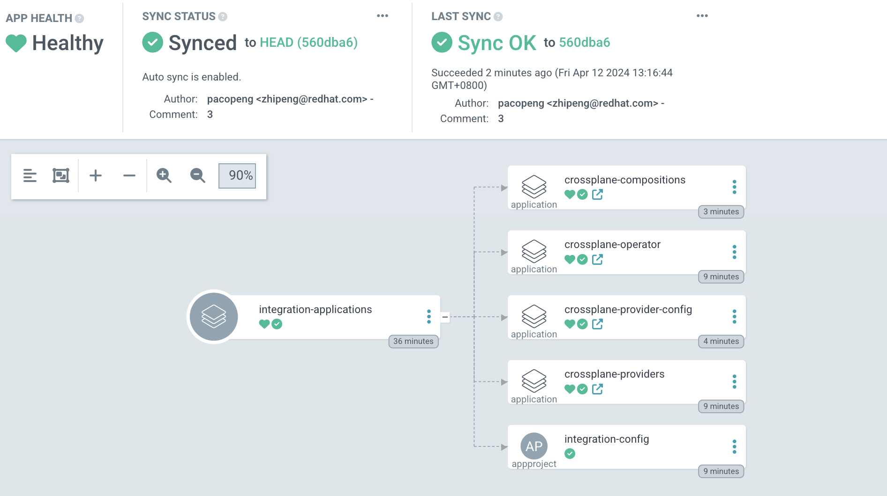
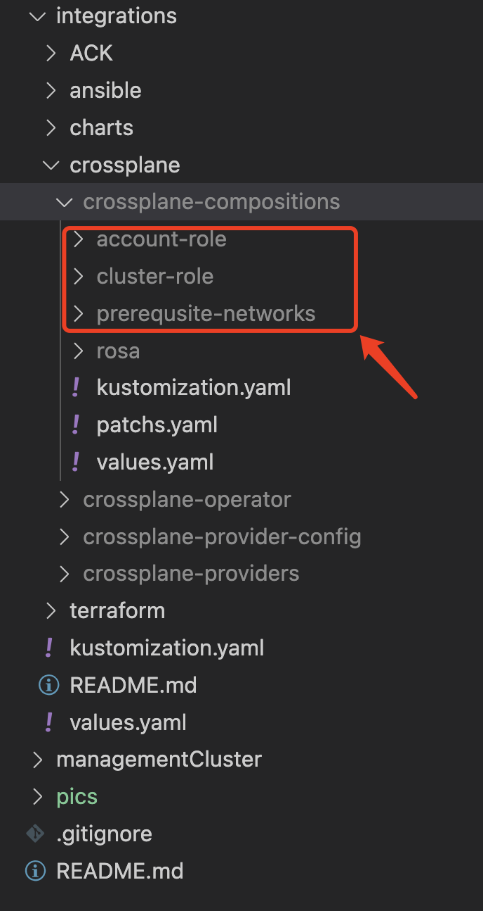

a place for integrtation tool to provision prerequisites(account roles,oicd,operator roles,network elements etc) for HCP ROSA
# ACK
# Ansible
# Terraform
# Crossplane

Crossplane is an open source Kubernetes extension that transforms your Kubernetes cluster into a universal control plane.
please refer to [crossplane](https://docs.crossplane.io/) for more details.

We use GitOps methodology to implement crossplane operator provision through Helm Charts and extend it with [AWS IAM/EC2 providers](https://marketplace.upbound.io/providers/upbound/provider-family-aws/v1.3.1/providers) to deal with AWS managed resources

We are still working on the account roles provision as ROSA provision require a mandatory suffix like "-ROSA-Worker-Role" for account roles which crossplane now only support lowercase alphabet in the managed resource name like "-rosa-worker-role". please follow below setps to setup up a gitops enviroments and provision crossplane controller and providers. 

you can direct jump to the next step if you already have done preparation for  GitOps enviroment by following [these steps](./README.md).

1. Preparation GitOps enviroment
 ```bash
export gitops_repo=https://github.com/<you_name>/declarative-openshift.git #<your newly created repo>
export cluster_name=managementCluster #<your management cluster name>
export cluster_base_domain=$(oc get ingress.config.openshift.io cluster --template={{.spec.domain}} | sed -e "s/^apps.//")
export platform_base_domain=${cluster_base_domain#*.}
oc apply -f .bootstrap/subscription.yaml
oc apply -f .bootstrap/cluster-rolebinding.yaml
envsubst < .bootstrap/argocd.yaml | oc apply -f -
 ```
2. Create integration application in argoCD

```bash
envsubst < .bootstrap/integration-application.yaml | oc apply -f -
```

bootstrap rosa-hcp-application will create below resources


 Prepare AWS key for crossplane

 ```bash
cat <<EOF >aws.txt
[default]
aws_access_key_id = <aws_key_id>
aws_secret_access_key = <aws_accesss_key>
EOF

oc create secret generic \
aws-secret \
-n crossplane-system \
--from-file=creds=./awskey.tx
 ```

we seperate prerequsites into three section(account roles,cluster roles,network elements)

please ignore the rosa and account-role folds for now.
will soon be replaced with declarative content within this repo. More to come on this soon..._